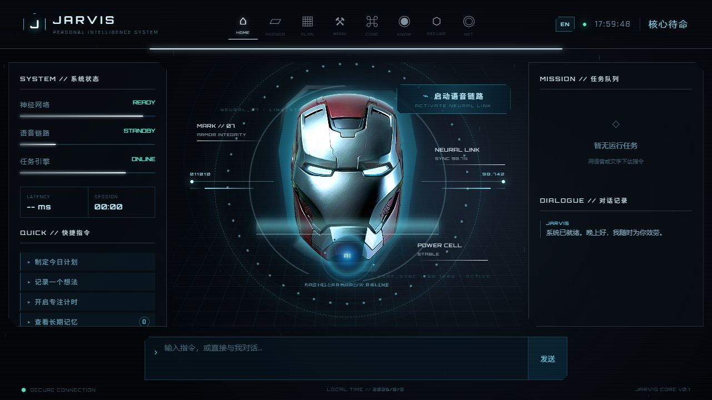
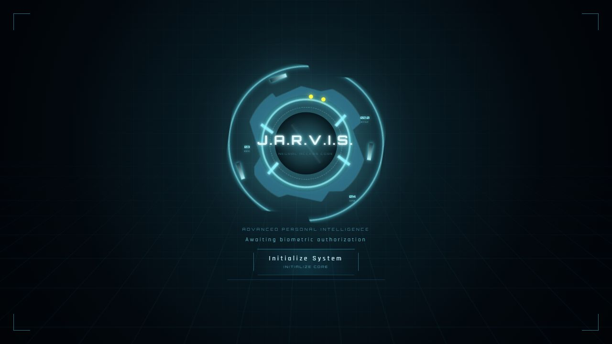
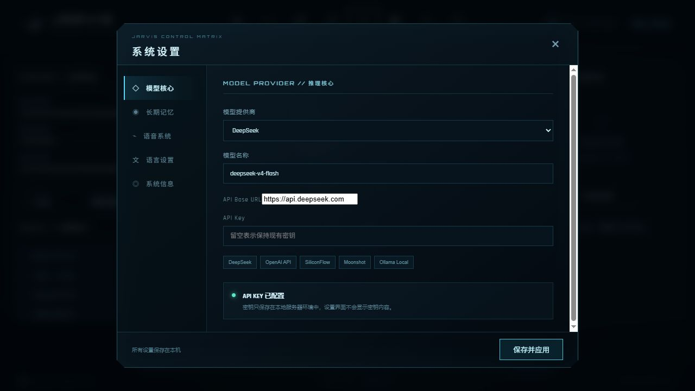
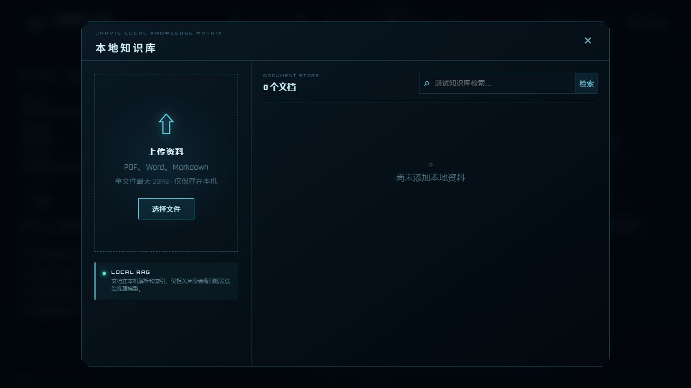

<div align="center">

# JARVIS — Personal Voice Intelligence System

**A cinematic, local-first AI command center for voice conversations, persistent memory, tasks, workspaces, and private knowledge.**

**English** · [中文](README.zh-CN.md)



</div>

## Overview

JARVIS is an original personal AI assistant prototype with a futuristic HUD, continuous voice interaction, configurable model providers, long-term memory, task scheduling, reusable conversation workspaces, and a local document knowledge base.

## Highlights

- **Voice-first interaction** — continuous browser speech recognition, interruption-safe listening, Edge TTS, system speech fallback, selectable voices, and adjustable rate, pitch, and robotic effect.
- **Multi-model core** — built-in presets for DeepSeek, OpenAI-compatible APIs, SiliconFlow, Moonshot, and local Ollama models.
- **Long-term memory** — stores useful preferences, habits, names, and goals locally; supports relevance search, capacity limits, manual deletion, and automatic memory rules.
- **Tasks and schedule center** — to-dos, reminders, repeating tasks, priorities, daily briefs, and ICS calendar import/export.
- **Conversation workspaces** — save and resume conversations, search history, switch assistant modes, and export a session as Markdown.
- **Local knowledge base** — upload PDF, DOCX, and Markdown files; build a local chunk index; retrieve relevant passages and cite their sources in answers.
- **Bilingual interface** — manually switch between English and Simplified Chinese.
- **Cinematic HUD** — animated reactor login, Iron-inspired armor interface, live metrics, scanning layers, and responsive panels.

## Interface

### Neural access core

The animated boot screen acts as the entry point to the system and displays continuously changing telemetry.



### Model and system control matrix

Configure the provider, model, endpoint, server-side API key, memory policy, voice, language, and system information from one control center.



### Local knowledge matrix

Documents are parsed and indexed on the local server. Only retrieved excerpts needed for a question are included in the model context.



## Feature map

| Module | What it does |
| --- | --- |
| **HOME** | Voice/text conversation, HUD status, active mission queue, and dialogue history |
| **AGENDA** | To-dos, reminders, repeats, priorities, daily brief, and calendar exchange |
| **PLAN** | Task and calendar planning with conflict awareness |
| **WORK** | Persistent sessions, history search, assistant modes, and Markdown export |
| **CORE** | Model provider, memory, voice, language, and system settings |
| **KNOW** | Local PDF/DOCX/Markdown ingestion, retrieval, and source-backed answers |

## Architecture

```text
Browser HUD (Vite / Vanilla JavaScript)
  ├─ Speech recognition + audio playback
  ├─ Animated UI, i18n, tasks, workspaces, settings
  └─ REST requests
           │
           ▼
Local Node.js / Express server
  ├─ Model gateway (DeepSeek / OpenAI-compatible / Ollama)
  ├─ Edge TTS gateway
  ├─ Long-term memory and workspace storage
  ├─ Tasks, schedules, reminders, and ICS exchange
  └─ Local document parsing and retrieval
           │
           ▼
Local data directory + configured AI provider
```

## Requirements

- Node.js 20 or newer
- npm
- A modern Chromium-based browser is recommended
- An API key for the selected cloud model provider, or a local Ollama-compatible endpoint
- Microphone permission for voice recognition

## Quick start

```bash
git clone git@github.com:clarke0922/Jarvis.git
cd Jarvis
npm install
```

Copy the environment template:

```bash
copy .env.example .env
```

Add your provider credentials to `.env` when using DeepSeek:

```env
DEEPSEEK_API_KEY=your_api_key_here
DEEPSEEK_MODEL=deepseek-chat
PORT=3001
```

Start the development environment:

```bash
npm run dev
```

Open `http://localhost:3001`, initialize the core, and allow microphone access when you want to use voice conversation.

## Model configuration

Open **CORE → Model Core** to select or customize a provider.

| Provider preset | Typical base URL | API key |
| --- | --- | --- |
| DeepSeek | `https://api.deepseek.com` | Required |
| OpenAI-compatible | Provider-specific `/v1` URL | Usually required |
| SiliconFlow | `https://api.siliconflow.cn/v1` | Required |
| Moonshot | `https://api.moonshot.cn/v1` | Required |
| Ollama Local | `http://localhost:11434/v1` | Not required |

The model name and base URL are editable, so other OpenAI-compatible services can be connected without changing source code.

## Voice configuration

Open **CORE → Voice System** to:

- enable or disable spoken responses;
- choose Yunxi, Yunyang, or Xiaoxiao neural voices;
- adjust speaking rate and pitch;
- control the robotic post-processing intensity;
- preview the current voice before saving.

Edge TTS is used first. If it is temporarily unavailable, JARVIS falls back to the browser's system speech engine when supported.

## Local data and privacy

Runtime data is stored under the local `data/` directory and is excluded from Git. This includes settings, provider secrets, memories, tasks, schedules, workspaces, document metadata, and uploaded knowledge files.

- API keys are handled by the local server and are never rendered back into the settings UI.
- Do not commit `.env` or the `data/` directory.
- Knowledge files are parsed locally; relevant excerpts may be sent to the configured model provider when answering a related question.
- Review your chosen provider's privacy policy before using sensitive documents.
- High-impact tools should always require explicit confirmation.

## Build and test

```bash
npm run build
npm test
npm run test:e2e
```

The production bundle is generated in `dist/`.

## Project structure

```text
Jarvis/
├─ index.html                 # Application entry
├─ server.js                 # Express API, AI gateway, TTS, and local storage
├─ src/
│  ├─ main.js                # Main UI and interaction controller
│  ├─ i18n.js                # English / Chinese interface strings
│  ├─ schedule-core.js       # Task and calendar domain logic
│  └─ *.css                  # HUD, reactor, settings, task, workspace, and knowledge UI
├─ tests/                    # Unit, API, and end-to-end tests
├─ docs/images/              # README screenshots
└─ data/                     # Local runtime data (ignored by Git)
```

## Disclaimer

This is a fan-made, non-commercial software prototype. It is not affiliated with or endorsed by Marvel, Disney, OpenAI, DeepSeek, or any actor. The assistant voice should remain an original synthetic voice and must not impersonate a real person. Referenced character imagery and trademarks belong to their respective owners; replace them with properly licensed assets before commercial distribution.

## Roadmap

- Native desktop packaging and wake-word support
- Encrypted local data vault and user profiles
- Calendar, email, smart-home, and desktop automation connectors
- Embedding-based vector retrieval for larger knowledge collections
- Fine-grained tool permissions, audit logs, and confirmation policies

<div align="right"><a href="#jarvis--personal-voice-intelligence-system">Back to top</a> · <a href="README.zh-CN.md">阅读中文说明</a></div>
